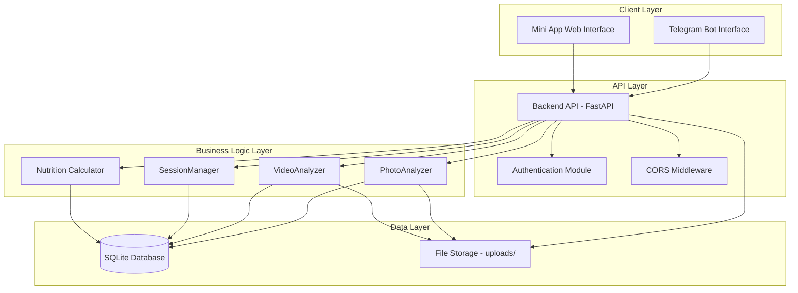

# Design Document: Fitness AI Coach Telegram Mini App

## Overview

The Fitness AI Coach TMA is a hybrid architecture system that provides both a Telegram bot interface and a web-based Mini App interface for nutrition tracking and analysis. The system consists of three main components:

1. **Existing Telegram Bot** (Python/aiogram) - Handles chat commands and quick interactions
2. **Backend API** (FastAPI) - Unified REST API serving both bot and TMA
3. **Frontend Mini App** (React/TypeScript) - Rich web interface for detailed nutrition management

The architecture ensures that both interfaces share the same business logic, database, and AI analysis modules, providing a consistent experience regardless of which interface the user chooses.

## Architecture

### System Architecture Diagram



### Component Responsibilities

**Telegram Bot (Existing)**
- Quick commands: /start, /today, /help
- Fallback for photo/video analysis from chat
- Push notifications to users
- Runs independently on port 3001

**Backend API (New)**
- REST API endpoints under /api/* prefix
- Authentication via Telegram WebApp initData validation
- CORS enabled for TMA domain
- Imports and uses existing modules (PhotoAnalyzer, VideoAnalyzer, etc.)
- Runs on port 8000
- Serves both bot and TMA requests

**Frontend Mini App (New)**
- React 18 + TypeScript + Vite
- Tailwind CSS for iOS-style UI
- Telegram WebApp SDK integration
- Client-side routing with React Router
- State management with Zustand
- Data visualization with recharts
- Hosted as static files (Vercel/Netlify/server)

**Shared Components**
- SQLite database (aiosqlite for async access)
- File storage in uploads/ directory
- AI analysis modules (PhotoAnalyzer, VideoAnalyzer)
- Business logic modules (SessionManager, nutrition calculators)

## Components and Interfaces

### Backend API Structure

```
backend_api/
├── main.py                 # FastAPI app, CORS, startup
├── dependencies.py         # Auth dependency
├── models.py              # Pydantic models
├── routers/
│   ├── auth.py           # POST /api/auth/verify
│   ├── user.py           # GET/PATCH /api/user/*
│   ├── nutrition.py      # CRUD /api/nutrition/*
│   └── analytics.py      # GET /api/analytics/*
└── utils.py              # Helper functions
```

### API Endpoints

**Authentication**
- `POST /api/auth/verify` - Validate Telegram WebApp initData

**User Management**
- `GET /api/user/profile` - Get user profile
- `PATCH /api/user/profile` - Update user profile
- `GET /api/user/stats/today` - Get today's nutrition stats

**Nutrition**
- `POST /api/nutrition/analyze-photo` - Analyze food photo
- `POST /api/nutrition/analyze-video` - Analyze video note
- `POST /api/nutrition/meals` - Create meal record
- `GET /api/nutrition/meals` - Get meals (with date filter)
- `PATCH /api/nutrition/meals/{meal_id}` - Update meal
- `DELETE /api/nutrition/meals/{meal_id}` - Delete meal

**Analytics**
- `GET /api/analytics/weight?period={week|month|year}` - Weight trends
- `GET /api/analytics/calories?period={week|month|year}` - Calorie trends

### Frontend Structure

```
miniapp-frontend/
├── src/
│   ├── main.tsx
│   ├── App.tsx
│   ├── lib/
│   │   ├── telegram-webapp.d.ts
│   │   ├── api.ts              # API client
│   │   └── theme.ts            # Theme utilities
│   ├── components/
│   │   ├── ui/                 # shadcn/ui components
│   │   ├── CameraCapture.tsx
│   │   ├── MealCard.tsx
│   │   ├── ProgressChart.tsx
│   │   └── DateSwitcher.tsx
│   ├── pages/
│   │   ├── DashboardPage.tsx
│   │   ├── DiaryPage.tsx
│   │   ├── AnalyticsPage.tsx
│   │   └── ProfilePage.tsx
│   ├── store/
│   │   ├── userStore.ts
│   │   ├── mealsStore.ts
│   │   └── themeStore.ts
│   └── styles/
│       └── globals.css
├── public/
│   ├── manifest.json
│   ├── icon-192.png
│   └── icon-512.png
└── vite.config.ts
```

## Data Models

### Database Schema (Existing)

```sql
-- Users table
CREATE TABLE users (
    id INTEGER PRIMARY KEY,
    telegram_id INTEGER UNIQUE NOT NULL,
    username TEXT,
    first_name TEXT,
    goals TEXT,  -- JSON: {calories: 2000, protein: 150, ...}
    height REAL,
    weight REAL,
    age INTEGER,
    gender TEXT,
    notifications_enabled BOOLEAN DEFAULT 1,
    created_at TIMESTAMP DEFAULT CURRENT_TIMESTAMP
);

-- Meals table
CREATE TABLE meals (
    id INTEGER PRIMARY KEY,
    user_id INTEGER NOT NULL,
    meal_time TEXT,  -- breakfast, lunch, dinner, snack
    photo_path TEXT,
    video_path TEXT,
    ingredients TEXT,  -- JSON array
    calories REAL,
    protein REAL,
    fats REAL,
    carbs REAL,
    created_at TIMESTAMP DEFAULT CURRENT_TIMESTAMP,
    FOREIGN KEY (user_id) REFERENCES users(id)
);
```

### API Request/Response Models

**UserProfile**
```typescript
interface UserProfile {
  telegram_id: number;
  username: string;
  first_name: string;
  goals: {
    calories: number;
    protein: number;
    fats: number;
    carbs: number;
  };
  height: number;
  weight: number;
  age: number;
  gender: 'male' | 'female' | 'other';
  notifications_enabled: boolean;
}
```

**DailyStats**
```typescript
interface DailyStats {
  date: string;
  consumed: {
    calories: number;
    protein: number;
    fats: number;
    carbs: number;
  };
  goals: {
    calories: number;
    protein: number;
    fats: number;
    carbs: number;
  };
  progress: {
    calories: number;  // percentage
    protein: number;
    fats: number;
    carbs: number;
  };
  meals_count: number;
}
```

**Meal**
```typescript
interface Meal {
  id: number;
  user_id: number;
  meal_time: 'breakfast' | 'lunch' | 'dinner' | 'snack';
  photo_path?: string;
  video_path?: string;
  ingredients: Array<{
    name: string;
    weight: number;
    calories: number;
    protein: number;
    fats: number;
    carbs: number;
  }>;
  calories: number;
  protein: number;
  fats: number;
  carbs: number;
  created_at: string;
}
```

**AnalysisResult**
```typescript
interface AnalysisResult {
  ingredients: Array<{
    name: string;
    weight: number;
    confidence: number;
  }>;
  nutrition: {
    calories: number;
    protein: number;
    fats: number;
    carbs: number;
  };
  photo_path: string;
}
```

## Correctness Properties

*A property is a characteristic or behavior that should hold true across all valid executions of a system—essentially, a formal statement about what the system should do. Properties serve as the bridge between human-readable specifications and machine-verifiable correctness guarantees.*

### Backend API Properties

**Property 1: CORS Headers Present**
*For any* request from TMA domain to Backend API, the response SHALL include appropriate CORS headers (Access-Control-Allow-Origin, Access-Control-Allow-Methods, Access-Control-Allow-Headers).
**Validates: Requirements 1.3**

**Property 2: API Path Prefix**
*For any* API endpoint, its path SHALL begin with /api/ prefix.
**Validates: Requirements 1.5**

**Property 3: Authentication Validation**
*For any* request with initData, the Backend API SHALL validate the signature using HMAC-SHA256 with bot token secret, and reject requests with invalid signatures by returning 401 status code.
**Validates: Requirements 2.1, 2.3**

**Property 4: User ID Extraction**
*For any* valid initData, extracting user_id SHALL return the correct user_id value that matches the user field in the initData.
**Validates: Requirements 2.2**

**Property 5: Profile Response Completeness**
*For any* user profile request, the response SHALL contain all required fields: goals, height, weight, age, gender, and notifications_enabled.
**Validates: Requirements 3.1**

**Property 6: Profile Update Round-Trip**
*For any* valid profile update, performing PATCH /api/user/profile followed by GET /api/user/profile SHALL return the updated values.
**Validates: Requirements 3.2**

**Property 7: Profile Validation**
*For any* invalid profile data (negative height, weight outside range 20-500kg, age outside range 10-120), the update SHALL be rejected with 400 status code.
**Validates: Requirements 3.3**

**Property 8: Daily Stats Completeness**
*For any* user stats request, the response SHALL contain consumed calories, protein, fats, carbs, and progress percentage for each macronutrient.
**Validates: Requirements 3.4**

**Property 9: Stats Calculation Correctness**
*For any* set of meals for a given date, the calculated daily stats SHALL equal the sum of individual meal values for each macronutrient.
**Validates: Requirements 3.5**

**Property 10: Photo Upload Persistence**
*For any* uploaded photo, the file SHALL exist in the uploads/ directory and its path SHALL be stored in the database meals table.
**Validates: Requirements 4.2, 4.3**

**Property 11: Analysis Response Completeness**
*For any* photo analysis result, the response SHALL contain ingredients array, and nutrition values for calories, protein, fats, and carbs.
**Validates: Requirements 4.4**

**Property 12: Meal Creation Round-Trip**
*For any* valid meal data, performing POST /api/nutrition/meals followed by GET /api/nutrition/meals SHALL return the created meal with matching data.
**Validates: Requirements 4.5**

**Property 13: Meal Update Round-Trip**
*For any* valid meal update, performing PATCH /api/nutrition/meals/{meal_id} followed by GET SHALL return the updated meal values.
**Validates: Requirements 4.6**

**Property 14: Meal Deletion**
*For any* existing meal, performing DELETE /api/nutrition/meals/{meal_id} followed by GET SHALL return 404 status code.
**Validates: Requirements 4.7**

**Property 15: Meals Date Filtering**
*For any* date parameter, GET /api/nutrition/meals?date=YYYY-MM-DD SHALL return only meals where created_at matches the specified date.
**Validates: Requirements 4.8**

**Property 16: Meals Grouping**
*For any* set of meals returned for a date, they SHALL be grouped by meal_time field (breakfast, lunch, dinner, snack).
**Validates: Requirements 4.8**

**Property 17: Analytics Period Filtering**
*For any* period parameter (week, month, year), GET /api/analytics/weight and GET /api/analytics/calories SHALL return only data points within the specified time range from current date.
**Validates: Requirements 5.1, 5.2**

**Property 18: Analytics Average Calculation**
*For any* set of daily calorie data, the calculated average SHALL equal the sum of daily values divided by the number of days.
**Validates: Requirements 5.4**

**Property 19: File Storage Uniqueness**
*For any* two file uploads, the generated filenames SHALL be different to prevent collisions.
**Validates: Requirements 19.2**

**Property 20: File Path Storage**
*For any* uploaded file, its path SHALL be stored in the database and the file SHALL be accessible via static file endpoint.
**Validates: Requirements 19.3, 19.4**

**Property 21: Error Response Structure**
*For any* error response from Backend API, it SHALL contain both error_code and message fields.
**Validates: Requirements 17.6**

**Property 22: Video Analysis Result Structure**
*For any* video analysis result, it SHALL have the same structure as photo analysis results (ingredients array and nutrition values).
**Validates: Requirements 16.4**

### Frontend Properties

**Property 23: Dashboard User Greeting**
*For any* user, when Dashboard loads, the rendered output SHALL contain the user's first_name.
**Validates: Requirements 7.1**

**Property 24: Dashboard Progress Chart**
*For any* daily stats data, the Dashboard SHALL render a progress chart component with calorie and macronutrient values.
**Validates: Requirements 7.2**

**Property 25: Dashboard Meals Display**
*For any* set of recent meals, all meals SHALL be displayed with their timestamps.
**Validates: Requirements 7.3**

**Property 26: Dashboard Data Refresh**
*For any* navigation back to Dashboard, the TMA SHALL fetch fresh data from GET /api/user/stats/today.
**Validates: Requirements 7.7**

**Property 27: Photo Upload Endpoint**
*For any* captured or selected photo, the TMA SHALL upload it to POST /api/nutrition/analyze-photo endpoint.
**Validates: Requirements 8.5**

**Property 28: Confirmation Screen Ingredients**
*For any* analysis result, the confirmation screen SHALL display all detected ingredients from the ingredients array.
**Validates: Requirements 8.6**

**Property 29: Meal Save Flow**
*For any* meal save action, the modal SHALL close and Dashboard SHALL refresh with updated data.
**Validates: Requirements 8.9**

**Property 30: Diary Meals Grouping**
*For any* set of meals on DiaryPage, they SHALL be grouped by meal_time (breakfast, lunch, dinner, snacks).
**Validates: Requirements 9.3**

**Property 31: Meal Details Display**
*For any* meal displayed on DiaryPage, it SHALL show photo (if exists), ingredients, calories, and macronutrients.
**Validates: Requirements 9.4**

**Property 32: Diary Date Change**
*For any* date change on DiaryPage, the TMA SHALL fetch meals for the new date from GET /api/nutrition/meals?date=YYYY-MM-DD.
**Validates: Requirements 9.8**

**Property 33: Analytics Chart Rendering**
*For any* weight or calorie data, AnalyticsPage SHALL render a chart using recharts library.
**Validates: Requirements 10.2, 10.3**

**Property 34: Analytics Period Change**
*For any* period change (week, month, year), AnalyticsPage SHALL refetch data with the new period parameter.
**Validates: Requirements 10.5**

**Property 35: Profile Form Fields**
*For any* user profile data, ProfilePage SHALL display editable fields for goals, height, weight, age, and gender.
**Validates: Requirements 11.2**

**Property 36: Profile Form Validation**
*For any* invalid profile form data, the TMA SHALL prevent submission and highlight invalid fields.
**Validates: Requirements 11.5**

**Property 37: Camera Photo Conversion**
*For any* captured photo from CameraCapture component, it SHALL be converted to File or Blob format suitable for FormData upload.
**Validates: Requirements 12.5**

**Property 38: Theme Detection**
*For any* value of Telegram.WebApp.colorScheme (light or dark), the TMA SHALL apply the corresponding theme.
**Validates: Requirements 13.2**

**Property 39: Theme Change Response**
*For any* Telegram theme change event, the TMA SHALL update its theme to match the new colorScheme value.
**Validates: Requirements 13.4**

**Property 40: Data Synchronization**
*For any* meal added through either Bot or TMA, the other interface SHALL see the meal on next data fetch.
**Validates: Requirements 15.1, 15.2**

**Property 41: Video Upload Endpoint**
*For any* recorded video, the TMA SHALL upload it to POST /api/nutrition/analyze-video endpoint.
**Validates: Requirements 16.2**

**Property 42: Error Message Display**
*For any* failed API request, the TMA SHALL display an error message to the user.
**Validates: Requirements 17.1**

**Property 43: Form Validation Highlighting**
*For any* form with validation errors, all invalid fields SHALL be highlighted with error messages.
**Validates: Requirements 17.4**

**Property 44: Loading Indicators**
*For any* async operation (API call, file upload), the TMA SHALL display a loading indicator until completion.
**Validates: Requirements 17.5**

**Property 45: Image Optimization**
*For any* image uploaded through TMA, the file size after optimization SHALL be less than or equal to the original size.
**Validates: Requirements 20.3**

## Error Handling

### Backend API Error Handling

**Authentication Errors**
- Invalid initData signature → 401 Unauthorized
- Missing initData → 401 Unauthorized
- Expired initData → 401 Unauthorized

**Validation Errors**
- Invalid request body → 400 Bad Request with field-specific errors
- Missing required fields → 400 Bad Request
- Invalid data types → 422 Unprocessable Entity

**Resource Errors**
- Meal not found → 404 Not Found
- User not found → 404 Not Found
- File not found → 404 Not Found

**Server Errors**
- Database connection failure → 500 Internal Server Error
- AI analysis timeout → 504 Gateway Timeout
- File upload failure → 500 Internal Server Error

**Error Response Format**
```json
{
  "error_code": "INVALID_INITDATA",
  "message": "Failed to validate Telegram WebApp initData",
  "details": {
    "field": "signature",
    "reason": "Signature mismatch"
  }
}
```

### Frontend Error Handling

**Network Errors**
- Display "Network error. Please check your connection."
- Show retry button for failed requests
- Cache last successful data for offline viewing

**API Errors**
- Parse error response and display user-friendly message
- Map error codes to localized messages
- Provide contextual help for common errors

**Validation Errors**
- Highlight invalid form fields in red
- Display inline error messages below fields
- Prevent form submission until all errors resolved

**Camera/Media Errors**
- Permission denied → Show instructions to enable camera
- Camera not available → Fallback to gallery picker
- Upload failed → Allow retry with same file

**State Management Errors**
- Failed to load data → Show error state with reload button
- Stale data → Display warning and refresh option
- Sync conflict → Prompt user to choose version

## Testing Strategy

### Dual Testing Approach

The testing strategy employs both unit tests and property-based tests to ensure comprehensive coverage:

**Unit Tests** focus on:
- Specific examples demonstrating correct behavior
- Edge cases (empty inputs, boundary values, special characters)
- Error conditions and exception handling
- Integration points between components
- UI component rendering and interactions

**Property-Based Tests** focus on:
- Universal properties that hold for all inputs
- Comprehensive input coverage through randomization
- Invariants that must be maintained
- Round-trip properties (serialize/deserialize, create/fetch)
- Data consistency across operations

Both approaches are complementary and necessary for high-quality software.

### Backend API Testing

**Property-Based Tests** (minimum 100 iterations each):

1. **Authentication Property Tests**
   - Generate random valid/invalid initData and verify validation
   - Test user_id extraction across various initData formats
   - **Feature: fitness-ai-coach-tma, Property 3**: Authentication Validation
   - **Feature: fitness-ai-coach-tma, Property 4**: User ID Extraction

2. **CRUD Round-Trip Tests**
   - Generate random meal data, create, fetch, verify equality
   - Generate random profile updates, update, fetch, verify
   - Generate random meal IDs, delete, verify 404
   - **Feature: fitness-ai-coach-tma, Property 12**: Meal Creation Round-Trip
   - **Feature: fitness-ai-coach-tma, Property 13**: Meal Update Round-Trip
   - **Feature: fitness-ai-coach-tma, Property 14**: Meal Deletion

3. **Data Filtering Tests**
   - Generate random dates and verify meal filtering
   - Generate random periods and verify analytics filtering
   - **Feature: fitness-ai-coach-tma, Property 15**: Meals Date Filtering
   - **Feature: fitness-ai-coach-tma, Property 17**: Analytics Period Filtering

4. **Calculation Tests**
   - Generate random meal sets and verify stats calculation
   - Generate random daily data and verify averages
   - **Feature: fitness-ai-coach-tma, Property 9**: Stats Calculation Correctness
   - **Feature: fitness-ai-coach-tma, Property 18**: Analytics Average Calculation

**Unit Tests**:
- Test specific error cases (401, 404, 400, 500)
- Test file upload with various image formats
- Test database connection handling
- Test CORS headers for specific domains
- Test API endpoint path prefixes

**Testing Tools**:
- pytest for test framework
- Hypothesis for property-based testing in Python
- pytest-asyncio for async test support
- httpx for API client testing
- faker for generating test data

### Frontend Testing

**Property-Based Tests** (minimum 100 iterations each):

1. **Data Display Tests**
   - Generate random user profiles and verify all fields displayed
   - Generate random meal sets and verify grouping
   - **Feature: fitness-ai-coach-tma, Property 35**: Profile Form Fields
   - **Feature: fitness-ai-coach-tma, Property 30**: Diary Meals Grouping

2. **Form Validation Tests**
   - Generate random invalid profile data and verify rejection
   - Generate random invalid meal data and verify highlighting
   - **Feature: fitness-ai-coach-tma, Property 36**: Profile Form Validation
   - **Feature: fitness-ai-coach-tma, Property 43**: Form Validation Highlighting

3. **Theme Tests**
   - Generate random colorScheme values and verify theme application
   - **Feature: fitness-ai-coach-tma, Property 38**: Theme Detection

**Unit Tests**:
- Test camera capture component mounting
- Test modal open/close flows
- Test date switcher navigation
- Test swipe gesture for delete
- Test loading indicator display
- Test error message display
- Test specific UI interactions (button clicks, form submissions)

**Testing Tools**:
- Vitest for test framework
- React Testing Library for component testing
- fast-check for property-based testing in TypeScript
- MSW (Mock Service Worker) for API mocking
- @testing-library/user-event for user interactions

### Integration Testing

**End-to-End Flows**:
1. Complete meal addition flow (camera → analysis → confirmation → save)
2. Profile update flow (edit → validate → save → verify)
3. Diary navigation flow (change date → load meals → display)
4. Analytics period change flow (select period → fetch → render chart)

**Cross-Interface Testing**:
1. Add meal via Bot → Verify in TMA
2. Add meal via TMA → Verify in Bot
3. Update profile in TMA → Verify in Bot commands

**Testing Tools**:
- Playwright or Cypress for E2E testing
- Telegram Bot API test client for bot testing

### Test Configuration

**Property Test Configuration**:
```python
# Backend (Hypothesis)
@given(st.from_type(MealData))
@settings(max_examples=100)
def test_meal_creation_roundtrip(meal_data):
    # Test implementation
    pass
```

```typescript
// Frontend (fast-check)
fc.assert(
  fc.property(
    fc.record({
      goals: fc.integer({min: 1000, max: 5000}),
      height: fc.integer({min: 100, max: 250}),
      weight: fc.integer({min: 20, max: 500}),
    }),
    (profile) => {
      // Test implementation
    }
  ),
  { numRuns: 100 }
);
```

### Continuous Integration

**CI Pipeline**:
1. Run linters (eslint, pylint)
2. Run type checkers (TypeScript, mypy)
3. Run unit tests
4. Run property-based tests
5. Run integration tests
6. Generate coverage reports (target: 80%+)
7. Build frontend and backend
8. Deploy to staging environment

**Test Execution Order**:
1. Fast unit tests first (< 1 second each)
2. Property-based tests second (< 10 seconds each)
3. Integration tests last (< 30 seconds each)
