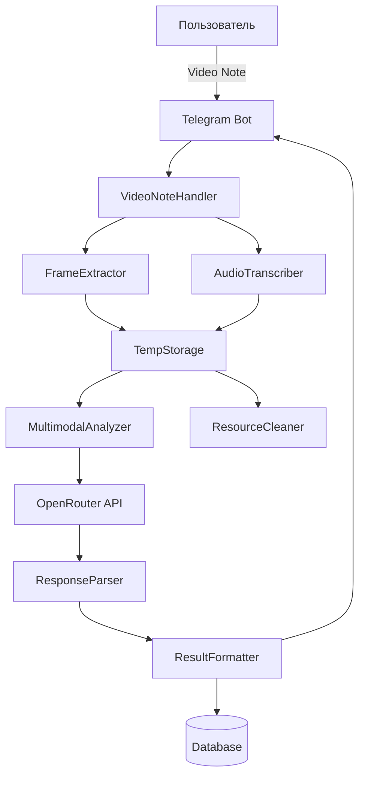

# Design Document: Video Note Analyzer

## Overview

Фича Video Note Analyzer добавляет возможность анализа еды через видео-кружки Telegram. Система извлекает ключевые кадры из видео, транскрибирует речь пользователя и отправляет мультимодальный запрос в AI для комплексного анализа калорий и БЖУ.

**Ключевые возможности:**
- Прием и обработка Video Note сообщений из Telegram
- Извлечение 5 равномерно распределенных кадров из видео
- Транскрипция речи пользователя (с поддержкой mock-режима)
- Мультимодальный анализ через OpenRouter API
- Форматирование результатов в стиле существующего photo analyzer
- Поддержка коррекций и сохранение в историю
- Graceful degradation при ошибках (например, анализ только по видео без аудио)

**Фазы реализации:**
1. **Фаза 1 (MVP):** Базовая обработка Video Note с mock-транскрипцией
2. **Фаза 2:** Реальное извлечение кадров через OpenCV
3. **Фаза 3:** Интеграция с OpenRouter для мультимодального анализа
4. **Фаза 4 (опционально):** Реальная транскрипция аудио

## Architecture

### High-Level Architecture



### Component Responsibilities

**VideoNoteHandler** (`handlers/video_notes.py`)
- Принимает Video Note сообщения от Telegram
- Проверяет регистрацию пользователя и состояние
- Координирует процесс анализа
- Управляет сессиями через SessionManager
- Обрабатывает ошибки и отправляет статусные сообщения

**FrameExtractor** (`modules/nutrition/frame_extractor.py`)
- Извлекает 5 равномерно распределенных кадров из видео
- Использует OpenCV (cv2) для работы с видео
- Сохраняет кадры в формате JPEG
- Обрабатывает ошибки извлечения отдельных кадров

**AudioTranscriber** (`modules/nutrition/audio_transcriber.py`)
- Извлекает аудио-дорожку из видео
- Отправляет аудио в сервис транскрипции
- Поддерживает mock-режим для тестирования
- Обрабатывает ошибки транскрипции gracefully

**MultimodalAnalyzer** (`modules/nutrition/video_note_analyzer.py`)
- Подготавливает мультимодальный запрос с кадрами и транскрипцией
- Отправляет запрос в OpenRouter API
- Реализует retry-логику (до 2 повторов)
- Парсит ответ AI и извлекает структурированные данные

**ResultFormatter** (использует существующий `utils/formatters.py`)
- Форматирует результаты анализа
- Добавляет индикатор использования голосовой информации
- Использует тот же стиль, что и photo analyzer

**ResourceCleaner** (часть VideoNoteHandler)
- Удаляет временные файлы после обработки
- Гарантирует cleanup даже при ошибках
- Использует уникальные идентификаторы для файлов

### Data Flow

1. **Прием Video Note:**
   - Пользователь отправляет Video Note
   - VideoNoteHandler проверяет регистрацию и состояние
   - Создается сессия через SessionManager
   - Видео скачивается во временное хранилище

2. **Извлечение данных:**
   - FrameExtractor извлекает 5 кадров
   - AudioTranscriber извлекает и транскрибирует аудио (или возвращает mock-данные)
   - Все данные сохраняются во временное хранилище

3. **Анализ:**
   - MultimodalAnalyzer подготавливает запрос с кадрами и транскрипцией
   - Запрос отправляется в OpenRouter API
   - Ответ парсится и валидируется

4. **Отображение результатов:**
   - ResultFormatter форматирует данные
   - Результаты отправляются пользователю с кнопками действий
   - Данные сохраняются в сессию

5. **Cleanup:**
   - Удаляются временные файлы (видео, кадры, аудио)
   - Сессия обновляется

## Components and Interfaces

### VideoNoteHandler

```python
async def handle_video_note_message(
    update: Update,
    context: ContextTypes.DEFAULT_TYPE
) -> None:
    """
    Обрабатывает входящие Video Note сообщения
    
    Args:
        update: Telegram update с Video Note
        context: Bot context
    
    Returns:
        None
    
    Raises:
        Обрабатывает все исключения внутри
    """
```

**Основной алгоритм:**
1. Проверить регистрацию пользователя
2. Проверить текущее состояние (должно быть IDLE или WAITING_FOR_PHOTO)
3. Отправить статусное сообщение "Обрабатываю видео..."
4. Создать сессию
5. Скачать видео во временное хранилище
6. Извлечь кадры через FrameExtractor
7. Извлечь и транскрибировать аудио через AudioTranscriber
8. Проанализировать через VideoNoteAnalyzer
9. Отформатировать и отправить результаты
10. Удалить временные файлы
11. Обработать ошибки на каждом этапе

### FrameExtractor

```python
class FrameExtractor:
    """Извлекает кадры из видео"""
    
    def __init__(self):
        """Инициализация"""
        pass
    
    async def extract_frames(
        self,
        video_path: str,
        output_dir: str,
        num_frames: int = 5
    ) -> List[str]:
        """
        Извлекает равномерно распределенные кадры из видео
        
        Args:
            video_path: Путь к видео файлу
            output_dir: Директория для сохранения кадров
            num_frames: Количество кадров для извлечения (по умолчанию 5)
        
        Returns:
            Список путей к извлеченным кадрам
        
        Raises:
            FrameExtractionError: Если не удалось извлечь ни одного кадра
        """
```

**Алгоритм извлечения кадров:**
1. Открыть видео через cv2.VideoCapture
2. Получить общую длительность и FPS
3. Вычислить интервалы: `interval = duration / (num_frames + 1)`
4. Для каждого кадра:
   - Вычислить timestamp: `t = interval * (i + 1)`
   - Перейти к timestamp
   - Прочитать кадр
   - Сохранить как JPEG с уникальным именем
5. Закрыть видео
6. Вернуть список путей к кадрам

### AudioTranscriber

```python
class AudioTranscriber:
    """Транскрибирует аудио из видео"""
    
    def __init__(self, use_mock: bool = False):
        """
        Инициализация
        
        Args:
            use_mock: Использовать mock-режим без реальной транскрипции
        """
        self.use_mock = use_mock
    
    async def transcribe_video(
        self,
        video_path: str
    ) -> Optional[str]:
        """
        Извлекает и транскрибирует аудио из видео
        
        Args:
            video_path: Путь к видео файлу
        
        Returns:
            Транскрибированный текст или None при ошибке
        
        Raises:
            Обрабатывает ошибки внутри, возвращает None
        """
```

**Mock-режим:**
- Возвращает предопределенный текст: "Это курица с рисом и овощами, примерно 300 грамм"
- Не вызывает внешние сервисы
- Используется для тестирования и Фазы 1

**Реальный режим (Фаза 4):**
- Извлекает аудио через ffmpeg или moviepy
- Отправляет в OpenAI Whisper API или аналог
- Указывает язык: Russian
- Обрабатывает ошибки gracefully

### VideoNoteAnalyzer

```python
class VideoNoteAnalyzer:
    """Анализирует видео-кружки с едой"""
    
    def __init__(self, use_mock: bool = False):
        """
        Инициализация
        
        Args:
            use_mock: Использовать mock-данные вместо реального API
        """
        self.use_mock = use_mock
        self.api_client = OpenRouterClient() if not use_mock else None
    
    async def analyze_video_note(
        self,
        frame_paths: List[str],
        transcription: Optional[str] = None
    ) -> Optional[Dict[str, Any]]:
        """
        Анализирует видео-кружок с едой
        
        Args:
            frame_paths: Список путей к кадрам из видео
            transcription: Транскрибированный текст (опционально)
        
        Returns:
            Словарь с результатами анализа или None при ошибке
            
        Структура результата:
        {
            'dish_name': str,
            'components': List[Dict],
            'calories_total': int,
            'protein_g': float,
            'fat_g': float,
            'carbs_g': float,
            'health_score': int,
            'transcription_used': bool
        }
        """
```

**Алгоритм анализа:**
1. Подготовить промпт с инструкциями
2. Если есть транскрипция, добавить в промпт
3. Загрузить все кадры в base64
4. Сформировать мультимодальный запрос
5. Отправить в OpenRouter API (модель: qwen/qwen-2-vl-7b-instruct:free)
6. При ошибке: повторить до 2 раз
7. Распарсить ответ
8. Валидировать данные
9. Вернуть результат

**Промпт для AI:**
```
Проанализируй еду на этих кадрах из видео.

[Если есть транскрипция:]
Пользователь сказал: "{transcription}"

Определи:
1. Название блюда
2. Компоненты (название, вес в граммах)
3. Для каждого компонента: калории, белки, жиры, углеводы
4. Общую калорийность и БЖУ
5. Оценку полезности (1-10)

Верни результат в JSON формате:
{
  "dish_name": "...",
  "components": [
    {
      "name": "...",
      "weight_g": 100,
      "calories": 200,
      "protein_g": 10,
      "fat_g": 5,
      "carbs_g": 20
    }
  ],
  "health_score": 7
}
```

### MockVideoNoteAnalyzer

```python
class MockVideoNoteAnalyzer(VideoNoteAnalyzer):
    """Mock-версия анализатора для тестирования"""
    
    async def analyze_video_note(
        self,
        frame_paths: List[str],
        transcription: Optional[str] = None
    ) -> Dict[str, Any]:
        """Возвращает предопределенные mock-данные"""
        return {
            'dish_name': 'Куриная грудка с рисом и овощами',
            'components': [
                {
                    'name': 'Куриная грудка',
                    'weight_g': 150,
                    'calories': 248,
                    'protein_g': 46.5,
                    'fat_g': 5.4,
                    'carbs_g': 0
                },
                {
                    'name': 'Рис отварной',
                    'weight_g': 100,
                    'calories': 130,
                    'protein_g': 2.7,
                    'fat_g': 0.3,
                    'carbs_g': 28.2
                },
                {
                    'name': 'Овощи тушеные',
                    'weight_g': 100,
                    'calories': 50,
                    'protein_g': 2,
                    'fat_g': 1,
                    'carbs_g': 8
                }
            ],
            'calories_total': 428,
            'protein_g': 51.2,
            'fat_g': 6.7,
            'carbs_g': 36.2,
            'health_score': 8,
            'transcription_used': transcription is not None
        }
```

## Data Models

### VideoNoteSession

Расширяет существующую модель Session в базе данных:

```python
{
    'session_id': str,  # Уникальный ID сессии
    'user_id': int,  # Telegram user ID
    'video_file_id': str,  # Telegram file ID видео
    'status': str,  # 'pending', 'completed', 'cancelled'
    'initial_analysis': Dict,  # Первичный анализ
    'corrected_analysis': Optional[Dict],  # Скорректированный анализ
    'corrections': List[Dict],  # История коррекций
    'transcription': Optional[str],  # Транскрибированный текст
    'created_at': datetime,
    'confirmed_at': Optional[datetime],
    'source_type': str  # 'video_note' для отличия от 'photo'
}
```

### AnalysisResult

```python
{
    'dish_name': str,  # Название блюда
    'components': List[Component],  # Список компонентов
    'calories_total': int,  # Общие калории
    'protein_g': float,  # Общие белки
    'fat_g': float,  # Общие жиры
    'carbs_g': float,  # Общие углеводы
    'health_score': int,  # Оценка полезности 1-10
    'transcription_used': bool,  # Использовалась ли транскрипция
    'warnings': List[str]  # Предупреждения
}
```

### Component

```python
{
    'name': str,  # Название компонента
    'weight_g': float,  # Вес в граммах
    'calories': int,  # Калории
    'protein_g': float,  # Белки
    'fat_g': float,  # Жиры
    'carbs_g': float,  # Углеводы
    'confidence': float  # Уверенность AI (0-1)
}
```

### TempFileInfo

```python
{
    'file_id': str,  # Уникальный ID файла
    'file_path': str,  # Путь к файлу
    'file_type': str,  # 'video', 'frame', 'audio'
    'created_at': datetime,  # Время создания
    'session_id': str  # ID сессии
}
```


## Correctness Properties

*A property is a characteristic or behavior that should hold true across all valid executions of a system—essentially, a formal statement about what the system should do. Properties serve as the bridge between human-readable specifications and machine-verifiable correctness guarantees.*

### Property 1: Video Note Acceptance
*For any* valid Video Note message sent by a registered user in IDLE or WAITING_FOR_PHOTO state, the VideoNoteHandler should accept and begin processing the message.
**Validates: Requirements 1.1**

### Property 2: Video Download Completion
*For any* accepted Video Note, the system should successfully download the video file to temporary storage with a unique identifier.
**Validates: Requirements 1.2, 9.5**

### Property 3: Frame Extraction Count and Spacing
*For any* video file, the FrameExtractor should extract exactly 5 frames at equal time intervals calculated as video_duration / 6.
**Validates: Requirements 2.1, 2.2**

### Property 4: Frame Format Compatibility
*For any* extracted frame, the file format should be either JPEG or PNG, compatible with the AI API.
**Validates: Requirements 2.3**

### Property 5: Partial Frame Extraction Resilience
*For any* video where some frames fail to extract, the system should continue extracting remaining frames and proceed with available frames (minimum 1 frame required).
**Validates: Requirements 2.4**

### Property 6: Audio Extraction
*For any* video file, the AudioTranscriber should attempt to extract the audio track.
**Validates: Requirements 3.1**

### Property 7: Mock Mode Behavior
*For any* video when Mock_Mode is enabled, the AudioTranscriber should return predefined mock transcription text without calling external services.
**Validates: Requirements 3.6**

### Property 8: Graceful Degradation on Transcription Failure
*For any* video where audio extraction or transcription fails or returns empty text, the system should proceed with visual-only analysis and notify the user.
**Validates: Requirements 3.4, 3.5, 4.5, 8.3**

### Property 9: Multimodal Request Preparation
*For any* set of extracted frames and optional transcription text, the MultimodalAnalyzer should prepare a request containing all frames and transcription (if available) with proper formatting.
**Validates: Requirements 4.1, 4.4**

### Property 10: API Retry Logic
*For any* API request that fails, the system should retry up to 2 times before notifying the user of the error.
**Validates: Requirements 4.6, 8.4**

### Property 11: Response Parsing Completeness
*For any* valid AI response, the system should parse and extract all required fields: dish name, components (with name, weight, calories, protein, fat, carbs), and health score.
**Validates: Requirements 5.1, 5.2**

### Property 12: Fallback Text Parsing
*For any* AI response that doesn't contain valid JSON, the system should attempt to extract structured data from text format before failing.
**Validates: Requirements 5.3**

### Property 13: Numeric Validation
*For any* parsed analysis result, all numeric values (calories, protein, fat, carbs, weight) should be non-negative.
**Validates: Requirements 5.5**

### Property 14: Result Formatting Completeness
*For any* parsed analysis data, the formatted output should include food names, weights, calories, macronutrients, appropriate emoji, total calculations, and Telegram markdown formatting.
**Validates: Requirements 6.1, 6.2, 6.3, 6.5**

### Property 15: Transcription Usage Indicator
*For any* analysis where transcription was used, the formatted message should indicate that voice information was considered.
**Validates: Requirements 6.4**

### Property 16: Correction Flow Consistency
*For any* video analysis result, the system should provide the same correction options, modification capabilities, total recalculation, and database storage as photo analysis.
**Validates: Requirements 7.1, 7.2, 7.3, 7.4**

### Property 17: Error Notification
*For any* error that occurs (download failure, complete frame extraction failure, persistent API failure), the system should notify the user with a clear, user-friendly error message while logging detailed error information.
**Validates: Requirements 8.1, 8.2, 8.4, 8.5**

### Property 18: Resource Cleanup
*For any* video processing session (successful or failed), the system should delete all temporary files (video, frames, audio) after processing completes or errors occur.
**Validates: Requirements 9.1, 9.2, 9.3, 9.4**

### Property 19: Integration Consistency
*For any* video analysis result, the database storage format, result display style, and user command support should match photo analysis exactly, with only a source type marker ('video_note' vs 'photo') differentiating them.
**Validates: Requirements 10.1, 10.2, 10.3, 10.4, 10.5**

## Error Handling

### Error Categories

**1. Download Errors**
- Telegram API timeout
- Network connectivity issues
- File size limits exceeded
- **Handling:** Notify user, log error, cleanup partial downloads

**2. Frame Extraction Errors**
- Corrupted video file
- Unsupported video format
- Individual frame extraction failure
- **Handling:** 
  - If all frames fail: notify user, cleanup
  - If some frames fail: continue with available frames (minimum 1)

**3. Audio Transcription Errors**
- Audio extraction failure
- Transcription service unavailable
- Empty transcription result
- **Handling:** Proceed with visual-only analysis, notify user

**4. API Errors**
- OpenRouter API timeout
- Rate limiting
- Invalid response format
- **Handling:** Retry up to 2 times, then notify user

**5. Parsing Errors**
- Invalid JSON in response
- Missing required fields
- Invalid numeric values
- **Handling:** Attempt text parsing fallback, validate data, notify user if complete failure

**6. Resource Errors**
- Disk space insufficient
- Permission denied for temp files
- **Handling:** Notify user, cleanup existing files

### Error Recovery Strategy

```python
try:
    # Main processing
    video_path = await download_video(video_note)
    frames = await extract_frames(video_path)
    transcription = await transcribe_audio(video_path)  # May return None
    
    if not frames:
        raise FrameExtractionError("No frames extracted")
    
    # Continue with available data
    result = await analyze(frames, transcription)
    
except DownloadError as e:
    await notify_user("Не удалось скачать видео. Попробуй ещё раз.")
    logger.error(f"Download failed: {e}")
    
except FrameExtractionError as e:
    await notify_user("Не удалось обработать видео. Попробуй другое видео.")
    logger.error(f"Frame extraction failed: {e}")
    
except APIError as e:
    await notify_user("Ошибка при анализе. Попробуй позже.")
    logger.error(f"API error: {e}")
    
finally:
    # Always cleanup
    await cleanup_temp_files(session_id)
```

### Graceful Degradation

**Scenario 1: Transcription Unavailable**
- Continue with visual-only analysis
- Notify user: "⚠️ Не удалось распознать речь, анализирую только видео"
- Mark result as `transcription_used: false`

**Scenario 2: Partial Frame Extraction**
- Continue with available frames (minimum 1)
- Log warning about missing frames
- Proceed with analysis

**Scenario 3: API Degraded Performance**
- Implement exponential backoff for retries
- Fall back to simpler model if available
- Cache recent results to reduce API calls

## Testing Strategy

### Dual Testing Approach

Тестирование будет включать как unit-тесты для конкретных примеров и edge cases, так и property-based тесты для проверки универсальных свойств.

**Unit Tests:**
- Специфические примеры корректного поведения
- Edge cases (пустое видео, очень короткое видео, видео без аудио)
- Интеграционные точки между компонентами
- Обработка ошибок

**Property-Based Tests:**
- Универсальные свойства, которые должны выполняться для всех входных данных
- Комплексное покрытие через рандомизацию
- Минимум 100 итераций на тест

### Property-Based Testing Configuration

**Библиотека:** `hypothesis` для Python

**Конфигурация:**
```python
from hypothesis import given, settings
import hypothesis.strategies as st

@settings(max_examples=100)
@given(
    video_duration=st.floats(min_value=1.0, max_value=60.0),
    num_frames=st.integers(min_value=1, max_value=10)
)
def test_frame_extraction_intervals(video_duration, num_frames):
    """
    Feature: video-note-analyzer, Property 3: Frame Extraction Count and Spacing
    
    For any video file, the FrameExtractor should extract exactly 5 frames
    at equal time intervals calculated as video_duration / 6.
    """
    # Test implementation
```

**Теги для property tests:**
- Формат: `Feature: video-note-analyzer, Property {N}: {property_text}`
- Каждое correctness property должно иметь соответствующий property-based тест
- Один property = один property-based тест

### Test Coverage

**Unit Tests:**
1. VideoNoteHandler
   - User registration check
   - State validation
   - Session creation
   - Error handling for each stage

2. FrameExtractor
   - Extraction with valid video
   - Extraction with corrupted video
   - Extraction with very short video (< 1 second)
   - Extraction with video without video track
   - Frame format validation

3. AudioTranscriber
   - Mock mode returns predefined text
   - Real mode extracts audio
   - Handles videos without audio track
   - Handles transcription service errors

4. VideoNoteAnalyzer
   - Analysis with frames only
   - Analysis with frames + transcription
   - Retry logic on API failure
   - Response parsing (valid JSON)
   - Response parsing (text fallback)
   - Numeric validation

5. ResultFormatter
   - Formatting with all fields
   - Formatting with transcription indicator
   - Markdown syntax validation
   - Emoji presence

6. ResourceCleaner
   - Cleanup on success
   - Cleanup on error
   - Unique file identifiers

**Property-Based Tests:**
1. Frame extraction count and spacing (Property 3)
2. Frame format compatibility (Property 4)
3. Partial extraction resilience (Property 5)
4. Mock mode behavior (Property 7)
5. Graceful degradation (Property 8)
6. API retry logic (Property 10)
7. Numeric validation (Property 13)
8. Resource cleanup (Property 18)

### Integration Tests

1. End-to-end flow with mock data
2. End-to-end flow with real OpenCV but mock API
3. End-to-end flow with real API (limited runs)
4. Correction flow integration
5. Database integration

### Test Data

**Mock Videos:**
- Short video (5 seconds)
- Medium video (30 seconds)
- Long video (60 seconds)
- Video without audio
- Corrupted video file

**Mock Transcriptions:**
- Russian text with food description
- Empty string
- Very long text (> 1000 characters)

**Mock API Responses:**
- Valid JSON with all fields
- Valid JSON with missing optional fields
- Text format (no JSON)
- Invalid numeric values
- Empty response

## Implementation Notes

### Dependencies

**New Dependencies:**
```
opencv-python==4.8.1.78  # For video processing
```

**Existing Dependencies:**
- python-telegram-bot
- openai (for OpenRouter API client)
- aiohttp
- sqlite3

### File Structure

```
handlers/
  video_notes.py          # NEW: Video Note handler

modules/nutrition/
  frame_extractor.py      # NEW: Frame extraction
  audio_transcriber.py    # NEW: Audio transcription
  video_note_analyzer.py  # NEW: Video analysis

utils/
  formatters.py           # EXTEND: Add video result formatting
  temp_storage.py         # NEW: Temporary file management

tests/
  test_video_notes.py     # NEW: Handler tests
  test_frame_extractor.py # NEW: Frame extraction tests
  test_audio_transcriber.py # NEW: Transcription tests
  test_video_note_analyzer.py # NEW: Analysis tests
  property_tests/
    test_frame_properties.py # NEW: Property-based tests
```

### Configuration

**config.py additions:**
```python
# Video Note settings
VIDEO_NOTE_ENABLED = True
VIDEO_NOTE_TEMP_DIR = '/tmp/video_notes'
VIDEO_NOTE_MAX_SIZE_MB = 20
VIDEO_NOTE_FRAME_COUNT = 5

# Transcription settings
USE_MOCK_TRANSCRIPTION = True  # Фаза 1: True, Фаза 4: False
TRANSCRIPTION_LANGUAGE = 'ru'

# OpenRouter settings for video analysis
OPENROUTER_VIDEO_MODEL = 'qwen/qwen-2-vl-7b-instruct:free'
OPENROUTER_MAX_RETRIES = 2
OPENROUTER_RETRY_DELAY = 2  # seconds
```

### Temporary File Management

**Naming Convention:**
```
{session_id}_video.mp4
{session_id}_frame_{index}.jpg
{session_id}_audio.mp3
```

**Cleanup Strategy:**
- Immediate cleanup after processing
- Scheduled cleanup of orphaned files (> 1 hour old)
- Cleanup on application shutdown

### Performance Considerations

**Frame Extraction:**
- OpenCV is synchronous, wrap in asyncio.to_thread()
- Extract frames in parallel if possible
- Limit frame resolution to 1920x1080

**API Calls:**
- Use aiohttp for async requests
- Implement connection pooling
- Set reasonable timeouts (30 seconds)

**Resource Usage:**
- Limit concurrent video processing (max 3 simultaneous)
- Monitor temp directory size
- Implement rate limiting per user

### Security Considerations

**File Validation:**
- Verify file is actually a video (check magic bytes)
- Limit file size (20MB max)
- Sanitize file names

**Temp Storage:**
- Use secure temp directory with proper permissions
- Generate cryptographically secure session IDs
- Prevent directory traversal attacks

**API Security:**
- Never log API keys
- Use environment variables for sensitive config
- Validate all API responses before processing

### Monitoring and Logging

**Metrics to Track:**
- Video processing success rate
- Average processing time
- Frame extraction success rate
- Transcription success rate
- API call success rate
- Temp file cleanup success rate

**Logging Levels:**
- INFO: Processing started/completed
- WARNING: Graceful degradation (e.g., no transcription)
- ERROR: Processing failures
- DEBUG: Detailed processing steps

**Log Format:**
```python
logger.info(
    f"Video note processing started: "
    f"user_id={user_id}, session_id={session_id}, "
    f"video_duration={duration}s"
)
```
